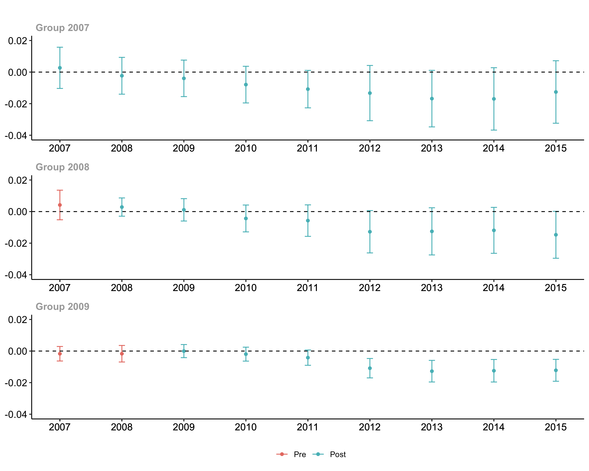

```{r setup, include=FALSE}
knitr::opts_chunk$set(echo = TRUE, message = FALSE)
library(Statamarkdown)
```

# This week
* (Previous week: [Panel data introduction](https://jisangyu-agecon.github.io/AGEC936/Lectures/AGEC936_Panel_Intro.html))
* Difference-in-differences (DID) in potential outcome framework
* Two-way Fixed Effects (TWFE)
* Parallel trend assumption
* Staggered treatment timing: When can TWFE fail and some alternatives

# Potential outcome representation
* With a binary treatment, $d_i=\{0,\;1\}$, let us denote the outcome of interest as
$$
y_i(0)\;\text{if}\;d_i=0 \\
y_i(1)\;\text{if}\;d_i=1
$$
* With an *ideal* research design, the difference, 
$$
y_i(1)-y_i(0)
$$ 
can be interpreted as **causal effect** [@rubin1974estimating]. In practice, **do we observe both $y_i(0)$ and $y_i(1)$**? 
* The *ideal* average treatment (causal) effect is defined as
$$
E(y_i(1)-y_i(0))=E(y_{i}(1))-E(Y_{i}(0)).
$$
* Instead, we observe 
$$
y_i=y_i(0)+(y_i(1)-y_i(0))d_{i}.
$$
and can estimate
$$
E(y_{i}|d_i=1)-E(y_{i}|d_i=0).
$$
* What happens if $y_i(0)$, $y_i(1)$, and $d_i$ are not independent?
$$
E(y_{i}|d_i=1)-E(y_{i}|d_i=0) \\
=E(y_i(0)+(y_i(1)-y_i(0))|d_i=1)-E(y_i(0)|d_i=0) \\
=\underbrace{\{E(y_i(1)|d_i=1)-E(y_i(0)|d_i=1)\}}_{ATT}+\underbrace{\{E(y_i(0)|d_i=1)-E(y_i(0)|d_i=0)\}}_{(Selection)\; Bias}.
$$
If the **Bias** term is non-zero, what should we do?

# Difference-in-differences (DID)
* **Set-up** 
Let's consider 2 x 2 case (two-period, $t={1,2}$, N-unit, $i={1,...,N}$, and two-group, $g={T,C}$ case). Potential outcomes are
$$
y_{it}(0)=\alpha_i+\gamma_t+\varepsilon_{it} \\
y_{it}(1)=\alpha_i+\gamma_t+\tau_i+\varepsilon_{it}
$$
For $i \in T$, $d_{i1}=0$ and $d_{i2}=1$ and for $i \in C$, $d_{i1}=0$ and $d_{i2}=0$.
* **Average Treatment Effect on Treated (ATT)**
$$
E(\tau_i|i \in T)
$$
This is normally what we want!
* **First differences**
$$
y_{i2}-y_{i1}=(\alpha_i+\gamma_2+\tau_i d_{i2}+\varepsilon_{i2}) - (\alpha_i+\gamma_1+\tau_i d_{i1}+\varepsilon_{i1}) \\
=(\gamma_2-\gamma_1)+\tau_i (d_{i2}-d_{i1})+(\varepsilon_{i2}-\varepsilon_{i1})
$$
Conditional expectations by group:
$$
E(y_{i2}-y_{i1}|i \in T)=(\gamma_2-\gamma_1)+E(\tau_i (d_{i2}-d_{i1})|i \in T)+E(\varepsilon_{i2}-\varepsilon_{i1}|i \in T) \\
=(\gamma_2-\gamma_1)+E(\tau_i |i \in T)
$$
$$
E(y_{i2}-y_{i1}|i \in C)=(\gamma_2-\gamma_1)+E(\tau_i (d_{i2}-d_{i1})|i \in C)+E(\varepsilon_{i2}-\varepsilon_{i1}|i \in C) \\
=(\gamma_2-\gamma_1)
$$
* **Difference-in-differences**
$$
E(y_{i2}-y_{i1}|i \in T)-E(y_{i2}-y_{i1}|i \in C)
=\{(\gamma_2-\gamma_1)+E(\tau_i |i \in T)\}-(\gamma_2-\gamma_1) \\
=E(\tau_i |i \in T)
$$

# Two-way Fixed Effects (TWFE)
* **Two-way Fixed Effects** We can also use the following regression equation:
$$
y_{it}=\alpha_i+\gamma_t+\tau_i d_{it}+\varepsilon_{it}
$$
With $T=2$, the OLS estimator for the equation above, denoted by $\hat{\tau}_{FE}$, is consistently estimating *ATT*. Need the following assumptions:
  + Strict exogeneity
  + Parallel trend 
* **"Parallel-trend" assumption**: Revisit the DinD expression,
$$
E(y_{i2}-y_{i1}|i \in T)-E(y_{i2}-y_{i1}|i \in C)
=\{(\gamma_2-\gamma_1)+E(\tau_i |i \in T)\}-(\gamma_2-\gamma_1) \\
=E(\tau_i |i \in T)
$$
This is valid if 
$$
\gamma_{it}=\gamma_{t}\;\text{for}\;\forall\;i.
$$

# A simulation: the equivalence between DID and TWFE
* **DGP**
$$
y_{it}=5+2(t-1)+4d_{it}+0.2x_{i}+\varepsilon_{it}\;\;\text{with}\;\;i=\{1,2,...,500\}\;\;\text{and}\;\;t=\{1,2\}
$$
$$
d_{i1}=0,\;\;
d_{i2}= \begin{cases}
1\;\;\text{if}\;\;i=\{1,...,250\} \\
0\;\;\text{otherwise}
\end{cases}
$$
$$
x_{i}=\begin{cases}
0.5+u_{i}\;\;\text{if}\;\;i=\{1,...,250\} \\
u_{i}\;\;\text{otherwise}
\end{cases}
\;\;\text{and}\;\;u_i \sim N(0,1)
$$

```{r simple, collectcode=TRUE}
library(lmtest)
library(sandwich)
# set seed
set.seed(11123)

# 500 units
N<-500
unit<-1:500

# Define treatment effect
tau<-4

# Treatment groups
d <- c(rep(0, N/2), rep(1, N/2))

# DGP
X <- d*0.5+rnorm(N)
# Pre
Y_1 <- 5+0.2*X+0.3*rnorm(N)
# Post
Y_2 <- 5+2+0.2*X+tau*d+0.3*rnorm(N)

# DinD
(mean(Y_2[d == 1]) - mean(Y_1[d == 1])) - (mean(Y_2[d == 0]) - mean(Y_1[d == 0]))
```

```{r simple2, collectcode=TRUE}
# Two-way Fixed Effects
# Data prep
dind_data <- data.frame("Y"=c(Y_1, Y_2),
                        "Treat"=c(rep(0,N), d),
                        "Unit"=c(unit, unit),
                        "Time"=c(rep(1,N), rep(2,N)))

# Two-way FE regression
TWFE <- lm(Y ~ Treat + as.factor(Time) + as.factor(Unit), data = dind_data)
Results<-coeftest(TWFE, vcov=vcovHC)
Results[2,]
```

**With $T=2$, DID and TWFE are numerically identical**

# Violation of parellel-trend assumption
* **DGP**
$$
y_{it}=5+2(t-1)x_{i}+4d_{it}+0.2x_{i}+\varepsilon_{it}\;\;\text{with}\;\;i=\{1,2,...,500\}\;\;\text{and}\;\;t=\{1,2\}
$$
$$
d_{i1}=0,\;\;
d_{i2}= \begin{cases}
1\;\;\text{if}\;\;i=\{1,...,250\} \\
0\;\;\text{otherwise}
\end{cases}
$$
$$
x_{i}=\begin{cases}
0.5+u_{i}\;\;\text{if}\;\;i=\{1,...,250\} \\
u_{i}\;\;\text{otherwise}
\end{cases}
\;\;\text{and}\;\;u_i \sim N(0,1)
$$

```{r simple_nonparellel}
library(lmtest)
library(sandwich)
# set seed
set.seed(11123)

# 500 units
N<-500
unit<-1:500

# Define treatment effect
tau<-4

# Treatment groups
d <- c(rep(0, N/2), rep(1, N/2))

# Adding the differential trend: 0.5*(t+1)*d
# DGP
X <- d*0.5+rnorm(N)
# Pre
Y_1 <- 5+0.2*X+0.3*rnorm(N)
# Post
Y_2 <- 5+2*X+0.2*X+tau*d+0.3*rnorm(N)

# DinD
(mean(Y_2[d == 1]) - mean(Y_1[d == 1])) - (mean(Y_2[d == 0]) - mean(Y_1[d == 0]))

# Two-way Fixed Effects
# Data prep
dind_data <- data.frame("Y"=c(Y_1, Y_2),
                        "Treat"=c(rep(0,N), d),
                        "Unit"=c(unit, unit),
                        "Time"=c(rep(1,N), rep(2,N)))

# Two-way FE regression
TWFE <- lm(Y ~ Treat + as.factor(Time) + as.factor(Unit), data = dind_data)
Results<-coeftest(TWFE, vcov=vcovHC)
Results[2,]
```

# What did we just estimate?
* Now, we no longer have
$$
\gamma_{it}=\gamma_{t}\;\text{for}\;\forall\;i.
$$
Thus,
$$
E(y_{i2}-y_{i1}|i \in T)-E(y_{i2}-y_{i1}|i \in C) \\
=E((\gamma_{i2}-\gamma_{i1})+\tau_i |i \in T)-E(\gamma_{i2}-\gamma_{i1}|i \in C) \\
=E(\tau_i|i \in T)+\underbrace{\{E(\gamma_{i2}-\gamma_{i1}|i \in T)-E(\gamma_{i2}-\gamma_{i1}|i \in C)\}}_{\text{Non-parallel trend bias}}.
$$
* In the previous example, we had
$$
\gamma_{it}=2(t-1)x_{i}
$$
which means
$$
\gamma_{i2}-\gamma_{i1}=2x_{i}.
$$
Therefore, the "non-parallel trend bias" term becomes,
$$
E(2x_{i}|i \in T)-E(2x_{i}|i \in C)=1
$$
since $E(x_{i}|i \in T)=0.5$ and $E(x_{i}|i \in C)=0$.

# What if we have $T>2$?
* **Single treatment timing**: We can test for parellel-trend/common-trend assumption if we have more than one "pre-treatment" periods. One way to do the pre-trend testing is to estimate
$$
y_{it}=\alpha_i+\gamma_t+\sum_t \delta_t \mathbb{1}_i (i \in T) + \varepsilon_{it}
$$
and "test" whether $\delta_t$ are jointly zeros for $t<t^*$ where $t^*$ is the treatment period. 
  + *Issues*: Can be under-powered and may lead to a biased estimate [@rothpre]
  + *Alternative approach*: "Honest" approach [@rambachan2019honest]
  + Functional forms? Theory?
* **Staggered treatment timing** and (dynamic) **heterogeneous treatment effects**: TWFE fails if the treatment is staggered AND the treatment effects are heterogeneous. Many recent papers discuss this issue. Two papers/approaches we will focus on
  + @de2020two
  + @callaway2020difference

# Single treatment timing with $T>2$: An example [@cai2016impact]
* Background
  1. The *experiment*: In 2003, the People's Insurance Company of China (PICC) started to offer a highly subsidized crop insurance program to tobacco producers in Guangchang county.
  2. @cai2016impact uses DID (and Triple difference) estimator to assess the impact of insurance provision on production and financail variables.
  3. Sample period: 2000 - 2008
  4. Here, let's focus on a production variable - Area of tobacco production.
  5. Disclaimer: I modified the original dataset -- kept only tobacco producers and restricted the sample to the households with all 9 year of data.
* Data set-up
```{r cai2016, results="hide"}
#libraries
library(tidyverse)
library(foreign)
library(plm)
library(lmtest)

#read data
cai_data<-read.dta("/Users/jisangyu/Dropbox/AGEC936/data/cai_AEJ_sample_balanced_tob_only.dta") %>%
  mutate(
    treatment=as_factor(treatment),
    hhno=as_factor(hhno),
    year=as_factor(year),
  )
```

* DID and TWFE give us equal estimates
```{r cai2016_2, collectcode=TRUE}
#Manual DID
#define subsets
pre_treated<-filter(cai_data, treatment==1, policy2==0)
pre_control<-filter(cai_data, treatment==0, policy2==0)
post_treated<-filter(cai_data, treatment==1, policy2==1)
post_control<-filter(cai_data, treatment==0, policy2==1)
#DID
(mean(post_treated$area_tob)-mean(pre_treated$area_tob))-(mean(post_control$area_tob)-mean(pre_control$area_tob))

#TWFE
TWFE<-plm(area_tob ~ did + as.factor(year),
          data=cai_data,
          index=c("hhno"),
          model="within")

coeftest(TWFE, vcov=function(x) vcovHC(x, cluster=c("group")))
```

# Testing for "pre-trend"
* Simply ploting means by year
```{r cai2016_mean, collectcode=TRUE}
ggplot(cai_data, aes(x=year, y=area_tob, color=treatment)) + 
stat_summary(aes(group = treatment), fun = mean, geom = 'line', size=1) 
```

* Regression-based: Estimate
$$
y_{it}=\alpha_i+\gamma_t+\sum_t \delta_t \mathbb{1}_i (i \in T) + \varepsilon_{it}
$$
and plot $\delta_t$.

```{r cai2016_3, collectcode=TRUE}
#Year x treatment
DT <- sapply(2000:2008, function(l) {
   1*( (cai_data$year == l) & (cai_data$treatment == 1) )
})
DT <-as.data.frame(DT)
colnames(DT)<-c(paste0("DT",2000:2008))
cai_data<-cbind.data.frame(cai_data,DT)

#Pre-trend regression
pretrend_reg <- cai_data %>% 
  plm(area_tob ~ year  + DT2001 + DT2002 + DT2003 + DT2004 + DT2005 + DT2006 + DT2007 + DT2008, 
      data=., model="within",
      index=c("hhno"))
results<-coeftest(pretrend_reg, vcov=function(x) vcovHC(x, cluster=c("group"))) 
results<-as.data.frame.matrix(results)

#plot
plot <- tibble(
  sd = results[[2]][9:16],
  mean = results[[1]][9:16],
  year = c(2001:2008))

plot %>% 
  ggplot(aes(x = year, y = mean)) + 
  ylab(expression(delta[t]))+
  geom_rect(aes(xmin=2003, xmax=2008, ymin=-Inf, ymax=Inf), fill = "cyan", alpha = 0.01)+
  geom_point()+
  geom_text(aes(label = year), hjust=-0.002, vjust = -0.03)+
  geom_hline(yintercept = 0) +
  geom_errorbar(aes(ymin = mean - sd*1.96, ymax = mean + sd*1.96), width = 0.2,
                position = position_dodge(0.05))
```

# Recent discussion related to "Staggered" treatment
* Different (staggered) treatment timings are nice! More variations!

* Can we still use TWFE?: Several recent papers show when and how TWFE can fail
  + @de2020two
  + @goodman2021difference (or [Mixtape's version of this](https://mixtape.scunning.com/difference-in-differences.html?panelset=r-code&panelset1=r-code2#twoway-fixed-effects-with-differential-timing))
  + [Guide by Callaway and Sant'Anna](https://bcallaway11.github.io/did/articles/multi-period-did.html)
  + @borusyak2017revisiting
  + @sun2020estimating
  + And recent review papers (@de2022two and @roth2022s)
  
* Alternatives to TWFE
  + @de2020two: uses a weighted-average of DID estimators.
  + @callaway2020difference: focuses on "group-time average treatment effect" and discusses different aggregation schemes of the group-time average treatment effect.

# @de2020two representation of TWFE estimator
* **Set-up** of @de2020two ($N_{g,t}=1$ version): Consider $N$ cross-sectional units, $i=1,...,N$, and $T>2$ time periods, $t=1,...,T$. Denote $y_{it}(d_{it})$ as  potential outcomes and the treatment status, $d_{it}$, can be zero or one. The treatment effect for each $(i,t)$ is
$$
\Delta_{i,t}=y_{it}(1)-y_{it}(0).
$$
(The ATT is $\Delta=E(y_{it}(1)-y_{it}(0)|d_{it}=1)$.)

* **TWFE regression**
Consider TWFE regression
$$
y_{it}=\alpha_i+\gamma_t+\tau d_{it}+\varepsilon_{it}.
$$
Do we have $E(\hat{\tau})$ converging to $E(\Delta_{i,t})$?

* **Theorem 1** of @de2020two (again, $N_{g,t}=1$ version)
$$
\tau=E\left(\frac{\sum_{(i,t):d_{it}=1}w_{it}\Delta_{it}}{\sum_i \sum_t d_{it}}\right)
$$
where
$$
w_{it}=\frac{\epsilon_{it}}{\frac{\sum_{(i,t):d_{it}=1}\epsilon_{it}}{\sum_i \sum_t d_{it}}},
$$
and 
$$
\epsilon_{it}=d_{it}-\bar{d}_i-\bar{d}_t+\bar{d}.
$$

# Why TWFE fails and when TWFE works?
* **Why TWFE fails?** $w_{it}$ does not necessary represent sample weights. Some $w_{it}$ can be **negative**!
  + In some unit-time observations, TWFE uses "treated" observations as controls... (see page 2971 of @de2020two)
  + Negative weights are more likely to the periods when a large fraction of units are treated, and to the units who treated for many periods.


* **If $\Delta_{it}=\Delta$ (i.e. homogeneous treatment effect),** we have 
$$
\tau=E\left(\frac{\sum_{(i,t):d_{it}=1}w_{it}\Delta_{it}}{\sum_i \sum_t d_{it}}\right)=\Delta
$$
TWFE works!

* **If $T=2$, $d_{i1}=0$ for all $i$, and $d_{i2}=1$ for some $i$,** we have $\epsilon_{i2}=\epsilon_{2}$ for $i$ with $d_{i2}=1$, and then
$$
w_{i2}=\frac{\epsilon_{2}}{\frac{\sum_{i:d_{i2}=1}\epsilon_{2}}{\sum_i d_{i2}}}=1
$$
TWFE works!

# @de2020two $DID_M$ estimator
* **The intuition**: Use the weighted average of i) "treatment effects" in groups who switch-in from $d_{it-1}=0$ to $d_{it}=1$ and ii) "treatment effects" in groups who switch-out from $d_{it-1}=1$ to $d_{it}=0$. For i), the benchmark group is $d_{it-1}=d_{it}=0$ and for ii), the benchmark group is $d_{it-1}=d_{it}=1$. 

* Robust to heterogeneous treatment effects (of course, requires some assumptions such as common trend).

* **$DID_M$ estimator**
$$
DID_M=\sum_{t=2} \left(\theta_{\text{switch-in},t}DID_{\text{switch-in},t}+\theta_{\text{switch-out},t}DID_{\text{switch-out},t}\right)
$$
where $\theta_{\text{switch-in},t}$ and $\theta_{\text{switch-out},t}$ are shares of observations that "switch-in" and "switch-out" over total treated observations in year $t$, and 
$$
DID_{\text{switch-in},t}=\frac{1}{N_{\text{switch-in},t}}\sum_{d_{it}=1,d_{it-1}=0} \left(y_{it}-y_{it-1}\right)-\frac{1}{N_{\text{not-treated},t}}\sum_{d_{it}=0,d_{it-1}=0} \left(y_{it}-y_{it-1}\right) 
$$
and
$$
DID_{\text{switch-out},t}=\frac{1}{N_{\text{treated},t}}\sum_{d_{it}=1,d_{it-1}=1} \left(y_{it}-y_{it-1}\right)-\frac{1}{N_{\text{switch-out},t}}\sum_{d_{it}=0,d_{it-1}=1} \left(y_{it}-y_{it-1}\right) 
$$

* The paper also offers an estimator that tests for common trend assumptions. The idea is to estimate $DID_M$ for $t-1$ and $t-2$ instead of $t$ and $t-1$ (but restrict the samples to $d_{it-1}=d_{it-2}$).

# @de2020two $DID_M$ estimator: a simulation example
```{stata did_m, collectcode=TRUE, results="hide"}
*Set up
clear all
set more off
set obs 50
*Generate panel data
set seed 1234
gen x=runiform(5,15)
sort x
gen id=_n
expand 3
bys id: gen t=_n
*Heterogeneous TEs
gen te=0
replace te=4*t if id>25
replace te=1*t if id<=25
*DGP
gen d=0
*group 1: treated in t=2 and t=3
replace d=1 if id>25 & t>=2
*group 2: treated in t=3
replace d=1 if id<=25 & t>=3
*outcome 
gen e=rnormal()
gen y=0.5+0.5*t+te*d+0.2*x+e
```
```{stata did_m2, collectcode=TRUE}
*ATT (observation number-weighted)
summ te if d==1
```
```{stata did_m3, collectcode=TRUE}
*TWFE
xtset id t
xtreg y d i.t, fe

*de Chaisematin & DHaultfoeuille DID estimator
did_multiplegt y id t d, breps(100)
```

# @callaway2020difference: Group-time average treatment effect
* **The key idea**: Think about "group-time" average treatment effect on treated.

* **Definition of "group"**: A group of units who received treatment in same time period, $G_g=1$ to indicate the group of units with the first-year of treatment is time $g$.

* **(Dynamic) potential outcomes**: A potential outcome of a unit who is in group $G_g$, i.e. who got treated *since* time $g$, is $y_{it}(g)$. Researchers observe
$$
y_{it}=y_{it}(0)+\sum_{t=2} \left(y_{it}(g)-y_{it}(0)\right)G_{ig}
$$
where $G_{ig}$ is the group indicator for unit $i$.

* **Group-time ATT**
$$
ATT(g,t)=E(y_t(g)-y_t(0)|G_g=1)
$$

* **Key assumptions** in estimating *group-time ATT*
  + Conditional parallel trends based on a "Never-treated" group
  + Conditional parallel trends based on a "Not-yet-treated" group
  
* **Estimation**
  + **Key idea**: Compare the differences in the outcomes between time $t$ and $g-\delta-1$ where $\delta$ is the length of "anticipation" periods. You can compare $G_g=1$ with "never-treated" group or with "not-yet-treated" group. Can use outcome regression, inverse probability weighting, or doubly robust estimands. See section 2.4. of @callaway2020difference.
  + **Doubly robust estimand (for the comparison to "not-yet-treated" group, assuming no anticipation)**
  $$
  E\left(\left(\frac{G_g}{E(G_g)}-\frac{\frac{p_{gt}(X)(1-d_{it})(1-G_g)}{1-p_{gt}(X)}}{E\left(\frac{p_{gt}(X)(1-d_{it})(1-G_g)}{1-p_{gt}(X)}\right)}\right) (y_{it}-y_{it-g}-m_{gt}(X)) \right)
  $$
  where $p_{gt}(X)$ is a propensity score for $G_g=1$, and $m_{gt}(X)$ is the difference explained by some covariates $X$.
  + Definition of **Doubly Robust**?: See @vermeulen2015bias.

* **Aggregation**: It depends on what you are interested in. For example, are you interested in the average of static effects *with-in* group? Or are you interested in the *dynamic* effects measured by the length of *exposure*. See table 1 of @callaway2020difference for the discussion on "weights".

# A potential application topic: PRF and rental rates
* Background
  1. Let's look at the effect of staggered roll-out of the PRF Rainfall index insurance program.
  2. Here, let's see whether having an insurance product available to ranchers affects rental rates for pastureland 
      - A relevant paper is @ifft2014impact: Finds a positive impact on farmland values using field-level data.
  3. The data span from 2009 to 2012 ($T=4$) and the first year counties have the PRF product available differs.
  4. All counties are "treated" in 2013 and later.
  
* Let's apply @callaway2020difference and @de2020two
  
```{r prf_example}
library(did)
library(DIDmultiplegt)
library(tidyverse)
library(foreign)
library(plm)
library(lmtest)

#read data
prf_data<-read.dta("/Users/jisangyu/Dropbox/AGEC936/data/prf_rent.dta")

#TWFE
TWFE<-plm(lnvalue ~ index + as.factor(year),
          data=prf_data,
          index=c("fips"),
          model="within")
coeftest(TWFE, vcov=function(x) vcovHC(x, cluster=c("group")))

# estimate group-time average treatment effects using att_gt method
prf_attgt <- att_gt(yname = "lnvalue",
                    tname = "t",
                    idname = "fips",
                    gname = "g",
                    panel = TRUE,
                    allow_unbalanced_panel = TRUE,
                    xformla= ~prec+prec2+tAvg,
                    control_group = c("notyettreated"),
                    anticipation=0,
                    data = prf_data
)

# summarize the results
summary(prf_attgt)
# plot the results
ggdid(prf_attgt)


# group-specific effects
agg.gs <- aggte(prf_attgt, type = "group")
summary(agg.gs)
# plot
ggdid(agg.gs)

# dynamic effects
agg.es <- aggte(prf_attgt, type = "dynamic")
summary(agg.es)
# plot
ggdid(agg.es)

# de Chaisemartin and DHautfoeuille DID_M
did_multiplegt(prf_data, "lnvalue", "fips", "t", "index", brep=50)
```

# A couple of notes on @de2020two vs @callaway2020difference
* @de2020two allows "switch-out" whereas @callaway2020difference works with strictly "staggered" cases (irreversable treatments).

* @callaway2020difference focuses more on treatment effects dynamics whereas @de2020two focuses on an instantaneous treatment effect.

* Unconditional [@de2020two] versus conditional [@callaway2020difference] designs.

* Packages
  + @de2020two: **did_multiplegt** (Stata) and **DIDmultiplegt** (R)
  + @callaway2020difference: **did** (R and Stata - see [here](https://github.com/NickCH-K/did))
  
# Another agricultural economics example
* [The effect of PRF availability on the Conservation Reserve Program enrollment](https://ambrook.com/research/the-conservation-reserve-program-is-competing-with-pasture-insurance-for-farmer-participation)

```{r, echo=FALSE, fig.align='center', out.width="70%"}
   
```


# Next week
[Panel Time Series/Synthetic Control](https://jisangyu-agecon.github.io/AGEC936/Lectures/AGEC936_Synth_Panel_time_series.html)

# References

