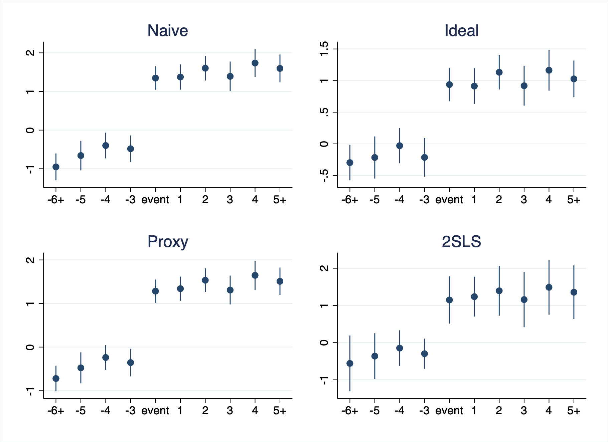

```{r setup, include=FALSE}
knitr::opts_chunk$set(echo = TRUE, message = FALSE)
library(Statamarkdown)
```

# This week
* ([Panel Time Series/Synthetic Control](https://jisangyu-agecon.github.io/AGEC936/Lectures/AGEC936_Synth_Panel_time_series.html))
* Revisiting IV in the context of Panel FE set-up
* Panel IV example 1: Bartik/Shift-share IV
* Guest lecture
* Panel IV example 2: Pre-event trends

# Revisiting IV in the context of Panel FE set-up
* Revisiting the identifying assumptions for Panel FE estimator
$$
\begin{align}
y_{it}=\alpha+\rho d_{it}+v_i + u_{it}
\end{align}
$$
Within-transformation ($\tilde{k}$ to denote the within transformation) leads to
$$
\begin{align}
\tilde{y}_{it}=\rho \tilde{d}_{it}+\tilde{u}_{it}
\end{align}
$$
  1. Strict exogeneity: We need $E(\tilde{u}_{it}|\tilde{d}_{it})$. The sufficient condition is $E(u_{it}|d_{i1}, d_{i2},...,d_{iT})=0$.
  2. The regressor, $d_{it}$, needs to vary within each cross-sectional unit over time.
  
* Revisiting the identifying assumptions for IV estimator (Let's ignore the panel structure for a moment)
$$
\begin{align}
y_{i}=\alpha+\rho d_{i}+\varepsilon_{i}
\end{align}
$$
$$
\begin{align}
d_{i}=\beta+\gamma z_{i}+\eta_{i}
\end{align}
$$
  1. Exclusion restriction: $E(u_{i}|z_{i})=0$
  2. Relevancy: $Cov(d_i,z_i) \neq 0$
  
* Now, let's think about the identifying assumptions for IV estimator in the context of **Panel FE** model
$$
\begin{align}
\tilde{y}_{it}=\rho \tilde{d}_{it}+\tilde{u}_{it}
\end{align}
$$
$$
\begin{align}
\tilde{d}_{it}=\gamma \tilde{z}_{it}+\eta_{it}
\end{align}
$$
  1. Exclusion restriction: We need $E(\tilde{u}_{it}|\tilde{z}_{it})$ or we can represent this condition as $E(z_{it}u_{it}|v_i)=0$. Note that the sufficient condition for this is $E(u_{it}|z_{i1}, z_{i2},...,z_{iT})=0$.
  2. Relevancy: $Cov(\tilde{d}_{it},\tilde{z}_{it}) \neq 0$ or we can write this as $Cov(d_{it},z_{it}|v_i)$ (Necessary to have some **within** variations in $z_{it}$).
  
# Some considerations
* Consider the following regression equation:
$$
\begin{align}
y_{it}=\alpha+\rho d_{it}+\varepsilon_{it}
\end{align}
$$
And you worry that, $Cov(d_{it},\varepsilon_{it}) \neq 0$. 

* Using an IV to mitigate this requires $z_{it}$ such that
$$
E(\varepsilon_{it}|z_{it})=0\;\;\text{and}\;\;Cov(z_{it},d_{it}) \neq 0
$$

* Recall that with Panel FE approach, we have
$$
\begin{align}
\tilde{y}_{it}=\rho \tilde{d}_{it}+\tilde{u}_{it}
\end{align}
$$
meaning that we need $z_{it}$ such that
$$
E(\tilde{u}_{it}|\tilde{z}_{it})=0\;\;\text{and}\;\;Cov(\tilde{z}_{it},\tilde{d}_{it}) \neq 0
$$

* Questions to think about
  1. If we have an instrument that satisfies $E(\varepsilon_{it}|z_{it})=0$, and $Cov(z_{it},d_{it}) \neq 0$, do we need to use Panel FE estimator?
  2. Do we obtain the consistency if we use Panel FE-2SLS with an instrument that satisfies $E(\varepsilon_{it}|z_{it})=0$, and $Cov(z_{it},d_{it}) \neq 0$?

# Some IV/GMM related topics in the context of Panel data applications
* Dynamic panel (Arellano-Bond type estimators)
* Bartik/Shift-share IVs
* Mitigating potential violation of parallel/common pre-event trends

# Panel IV example 1: Bartik/Shift-share IV
* Named after @bartik1991benefits, also known as "Shift-share" IV.
* The idea is to combine "aggregated/macro-level shocks" and a measure for "heterogeneous (local) exposures" and use this combination as an "instrument".
* I like the framework of @goldsmith2020bartik, so I will form our discussion around it (two other related papers are @adao2019shift and @borusyak2020quasi -- please do check out if you are interested in this literature)
* **Set up**: Consider the following regression equation (now we use subscript $l$ instead of $i$ to emphasize that the unit of observations is at "locality" level):
$$
y_{lt}=\alpha+\beta x_{lt}+v_l+u_{lt}
$$
where the regressor, $x_l$, can be represented as (not necessarily) 
$$
x_{lt}=\sum_k z_{lkt} g_{lkt}.
$$
and suppose we have $E(x_{lt}u_{lt}|v_l) \neq 0$. That is, **Panel FE** estimator will not provide a consistent estimate $\hat{\beta}$.
* An example for the variables:
  + $y_{lt}$: Wage in area $l$ in time $t$,
  + $x_{lt}$: Employment growth rate in area $l$ in time $t$,
  + $z_{lkt}$: Employment share of sector $k$ in area $l$ in time $t$,
  + $g_{lkt}$: Growth rate of sector $k$ in area $l$ in time $t$.
* **Bartik Instrument**: It usually takes the following form
$$
B_{lt}=\sum_k z_{lk0} g_{kt},
$$
  + $z_{lk0}$: The share of industry/sector $k$ in location $l$ in the base/initial period $0$.
  + $g_{kt}$: The (aggregated) shock to industry/sector $k$ in time $t$. This comes from
  $$
  g_{lkt}=g_{kt}+\tilde{g}_{lkt}
  $$
where $\tilde{g}_{lkt}$ is the idiosyncratic shock/variation.

# A simulation example of a simple Bartik IV
```{stata bartik}
clear all
set seed 11123

* l=1000
set obs 1000
gen l=_n

* v_l
gen v=runiform(-0.1,0.1)

* k=7 & create initial shares
forval k=1/6{
	gen z`k'=runiform(0,0.13)
}
gen z7=1-z1-z2-z3-z4-z5-z6

* t=10
expand 10
bys l: gen t=_n

* change shares as time evolves
forval k=1/6{
	replace z`k'=z`k'*(1+t*0.1*runiform(0,0.2)) if t>1
}
replace z7=1-z1-z2-z3-z4-z5-z6 if t>1

* growth rates at kt
forval k=1/7{
gen g`k'=1+runiform(-0.2,0.2)
}

* growth rate at lkt
forval k=1/7{
gen latent_l`k'=runiform(0,0.25)
gen gl`k'=g`k'*(1+latent_l`k')+1.5*v
}

* x at lkt
forval k=1/7{
gen x`k'=gl`k'*z`k'
}
gen x=x1+x2+x3+x4+x5+x6+x7

* DGP: y at lkt
gen y=2+3*x+(latent_l1+latent_l2+latent_l3+latent_l4+latent_l5+latent_l6+latent_l7)+0.5*v+rnormal()

* OLS
reg y x, robust

* FE
xtset l t
xtreg y x, fe robust

* FE2SLS Bartik
* Bartik instrument
* create initial share variable
gen initial=0
replace initial=1 if t==1
forval k=1/7{
gen tempz`k'=initial*z`k'
bys l: gen z0`k'=sum(tempz`k')
}
* Bartik instrument
forval k=1/7{
gen bartik`k'=z0`k'*g`k'
}	
gen bartik=bartik1+bartik2+bartik3+bartik4+bartik5+bartik6+bartik7
* FE 2SLS
xtivreg2 y (x=bartik), fe robust first
```

# Identifying assumptions
* Recall that the (second-stage) regression equation is
$$
y_{lt}=\alpha+\beta x_{lt}+v_l+u_{lt}
$$
and the Bartik Instrument is
$$
B_{lt}=\sum_k z_{lk0} g_{kt},
$$
* Identifying assumptions for FE2SLS
  + Exclusion restriction
  $$
  E(B_{lt}u_{lt}|v_l)=0
  $$
  + Relevance
  $$
  Cov(x_{lt},B_{lt}|v_l) \neq 0
  $$
* Let's be more specific. The FE2SLS estimator with the Bartik instrument is [@goldsmith2020bartik;@borusyak2020quasi]
$$
\hat{\beta}_{Bartik}=\frac{\sum_l \sum_t \sum_k z_{lk0}g_{kt}\tilde{y}_{lt}}{\sum_l \sum_t \sum_k z_{lk0}g_{kt}\tilde{x}_{lt}}
$$
where $\tilde{k}$ is the residual of regress $k$ on $v_l$ (or any possible other covariates).
* This leads to
$$
\hat{\beta}_{Bartik}-\beta=\frac{\sum_l \sum_t \sum_k z_{lk0}g_{kt}\tilde{u}_{lt}}{\sum_l \sum_t \sum_k z_{lk0}g_{kt}\tilde{x}_{lt}} \\
=\frac{\sum_t \sum_k g_{kt} \sum_l z_{lk0} \tilde{u}_{lt}}{\sum_t \sum_k g_{kt} \sum_l z_{lk0} \tilde{x}_{lt}}
$$
  + $L$ consistency: $E(z_{lk0} \tilde{u}_{lt})=0$ (Focus of @goldsmith2020bartik)
  + $K$ consistency: $E( g_{kt} \eta_{kt})=0$ where $\eta_{kt}=\sum_l z_{lk0} \tilde{u}_{lt}$.

# Decomposition and Rotemberg weights
* @goldsmith2020bartik shows the following (I am presenting the version of their representation in Panel data set-up):
$$
\hat{\beta}_{Bartik}=\sum_k \sum_s \hat{\alpha}_{ks} \hat{\beta}_{ks}
$$
where 
$$
\hat{\beta}_{ks}=\frac{\sum_l \sum_t z_{lk0} \times \mathbb{1}_{t}(t=s)\tilde{y}_{lt}}{\sum_l \sum_t z_{lk0} \times \mathbb{1}_{t}(t=s)\tilde{x}_{lt}}
$$
and
$$
\hat{\alpha}_{ks}=\frac{\sum_l \sum_t g_{kt} z_{lk0} \times \mathbb{1}_{t}(t=s)\tilde{x}_{lt}}{\sum_k \sum_l \sum_t g_{kt} z_{lk0} \times \mathbb{1}_{t}(t=s)\tilde{x}_{lt}}.
$$
(This is the @goldsmith2020bartik decomposition based on Rotemberg weights)
* Interpretation of the decomposition: $\hat{\beta}_{ks}$ is an IV estimate that uses $z_{lk0} \times \mathbb{1}_{t}(t=s)$ as an instrument.
* Implications of the weight $\hat{\alpha}_{ks}$: If $\hat{\beta}_{ks}$ is biased (potentially, due to the misspecified moment condition), $\hat{\alpha}_{ks}$ represents how much of this bias translates to the overall bias.

# Approaches to test for identifying assumptions
* Check the correlations between initial characteristics and initial shares, $z_{lk0}$: Visualize the source of variation, and potentially can control for the characteristics that is correlated with the shares (the correlated initial characteristic times time dummies).
* Testing for pre-trends.
* Use many instruments (e.g. $z_{lk0} \times \mathbb{1}_{t}(t=s)$) and compare or do over-identification test.

# Pre-event trends: Going back to the parallel/common trend assumption
* Motivation: What if the parallel/common trend assumption falls apart?
* One way is to control for observables -- conditional parallel/common trend [e.g. @callaway2020difference].
* Denote $y$ as the outcome, $d$ as the treatment, $x$ as the observable control, and $w$ as the unobservable confounder (assume the within transformation). Here is my attempt on drawing DAG for this problem (Full disclosure -- I am as new to DAG as you are so this needs some verification):

```{r dag, fig.align='center', out.width="50%"}
library(dagitty)
library(ggdag)

dag <- dagitty("dag{y1 <- w1 -> d1
                d1 -> y1
                w1 -> x1
               }")
ggdag(dag, layout = "circle") +
  theme_dag()
```

# Panel IV example 2: Pre-event trends [@freyaldenhoven2019pre]
* Again, an attempt to draw a DAG to show the IV approach can work:
```{r dag2, fig.align='center', out.width="50%"}
library(dagitty)
library(ggdag)

dag <- dagitty("dag{y1 <- w1 -> d1
                d1 -> y1
                w1 -> x1
                w1 -> w2
                w2 -> d2
               }")
ggdag(dag, layout = "circle") +
  theme_dag()
```

* Obviously, using the observable control is fine if the observable $x$ **perfectly** explains the unobservable confounder, $w$. If not, we have so-called **regression diultion/measurement error** bias.
* The **key** idea of @freyaldenhoven2019pre: Use the **lead(s)** of the treatment variable as **instruments**.
* Practically, one can do the following (again, all variables are within transformed): regress $y$ on $d$ and $x$ but **instrument** $x$ using the **leads** of $d$.

# A mini-version simulation of @freyaldenhoven2019pre: Pre-trend
```{stata first, collectcode=TRUE, results="hide"}
clear
set seed 11123
set obs 500

egen id = seq()
bys id: gen alpha = rnormal(0,1) 
expand 20
sort id
by id: gen year=_n
xtset id year

*create eta
bys id: gen eta=0 if _n==1
bys id: replace eta=eta[_n-1]+rnormal(0,1) if _n>1
*create x
bys id: gen x = eta + rnormal(0,2)
*create z
bys id: gen dtemp = eta 
bys id: gen d = (dtemp >4)
bys id: replace d=1 if d[_n-1]==1
drop dtemp

*create y
bys id: gen y = d + .25*eta + .2*year + alpha + rnormal(0,1)

*create dummmies for time period of event and pre/post
bys id: gen event = d-d[_n-1]
recode event (.=0)
foreach n of num 1(1)5{
  bys id: gen t_`n'=event[_n+`n']
  bys id: gen t`n'=event[_n-`n']
}
recode t* (.=0)

*create instruments
foreach n of num 1(1)5 {
  bys id: gen d_lead`n'=F`n'.d
  bys id: replace d_lead`n'=1 if d_lead`n'[_n-1]==1
}
recode d* (.=0)

*Add dummies for both sides of eventplot
bys id: gen t_6=-d_lead5
bys id: replace t5=1 if t5[_n-1]==1
recode t5 (.=0)

*labeling for figures
label var t_6 "-6+"
label var t_5 "-5"
label var t_4 "-4"
label var t_3 "-3"
label var t_2 "-2"
label var t_1 "-1"
label var t1 "1"
label var t2 "2"
label var t3 "3"
label var t4 "4"
label var t5 "5+"

*keep sample with enough lead and lag
keep if year>6 & year<16
*pre-trends comparison
areg y t_6 t_5 t_4 t_3 t_2 event t1 t2 t3 t4 t5 i.year, absorb(id) vce(cluster id)
coefplot, keep(t_6 t_5 t_4 t_3 event t1 t2 t3 t4 t5) vertical graphregion(color(white)) title("Naive") saving(nocontrol.gph, replace)

areg y t_6 t_5 t_4 t_3 event t1 t2 t3 t4 t5 eta i.year, absorb(id) vce(cluster id)
coefplot, keep(t_6 t_5 t_4 t_3 event t1 t2 t3 t4 t5) vertical graphregion(color(white)) title("Ideal") saving(eta.gph, replace)

areg y t_6 t_5 t_4 t_3 event t1 t2 t3 t4 t5 x i.year, absorb(id) vce(cluster id)
coefplot, keep(t_6 t_5 t_4 t_3 event t1 t2 t3 t4 t5) vertical graphregion(color(white)) title("Proxy") saving(proxy.gph, replace)

xi: xtivreg2 y t_6 t_5 t_4 t_3 event t1 t2 t3 t4 t5 (x=d_lead1) i.year, fe cluster(id)
coefplot, keep(t_6 t_5 t_4 t_3 event t1 t2 t3 t4 t5) vertical graphregion(color(white)) title("2SLS") saving(panel2sls.gph, replace)

graph combine nocontrol.gph eta.gph proxy.gph panel2sls.gph, col(2) graphregion(color(white))
graph export preevent_trend.png, replace

rm nocontrol.gph
rm eta.gph
rm proxy.gph
rm panel2sls.gph
```

```{r, echo=FALSE, fig.align='center', out.width="70%"}
   
```

# A mini-version simulation of @freyaldenhoven2019pre: ATE
```{stata second, collectcode=TRUE}
*Not mitigating non-parallel trend
areg y d i.year, absorb(id) vce(cluster id)
*FE2SLS
xi: xtivreg2 y d (x=d_lead1) i.year, fe cluster(id)
```


# What else...?
* Survey: [Click here](https://kstate.qualtrics.com/jfe/form/SV_0cXZVbMH9TBeOTI)
* Questions?

# References

