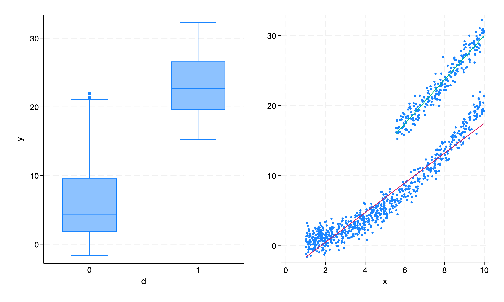

```{r setup, include=FALSE}
knitr::opts_chunk$set(echo = TRUE)
library(Statamarkdown)
```


# Introduction: Key materials 

* Slides 

* Readings

* Useful textbooks (no need to purchase, The Mixtape and The Effect are freely available online)

  + Cameron, A.C. and Trivedi, P.K., 2005. Microeconometrics: Methods and Applications.
  + Cunningham, S., 2021, Causal Inference: The Mixtape, [link](https://mixtape.scunning.com/)
  + Hungington-Klein, N., 2022, The Effect: An Introduction to Research Design and Causality, [link](https://theeffectbook.net/)

# Introduction: Assignments

* Problem set (most likely one)

* Referee report (5 page max): Choose an empirical paper that utilizes panel data and does a causal analysis based on panel data approaches. Choose from major economics or agricultural economics journals (limit the time period to post-2010). Please submit the citation of the paper of your choice by **11$^{th}$ of March**. Your referee report is due **25$^{th}$ of March**. Your referee report should contain

  + A brief summary of the paper (0.5 page)
  + Describe the main empirical specification and the identification strategy of the paper (1 -- 1.5 page)
  + Your criticism on the identification strategy (1 page)
  + Discuss possible alternative approaches (1 page)
  + Conclude with the lessons you learned (1 page)

# Introduction: What we will cover

1. Understanding panel data and causal inference

2. Fixed effects and Difference-in-Differences

3. Synthetic control

4. Panel IV/GMM

5. Shift-share design

6. *Any other panel-related topics you are interested in? (Let me know by coming Friday)*

* Guest Lecture on publishing (Dr. Jesse Tack, March 23rd)

# Introduction: My goals here are...

* To bring various (and mostly recent) empirical issues related to panel data analyses to your attention

* To help you become a critical consumer and a careful producer of empirical studies

* Not necessarily "teach" you new methods -- I will provide various frameworks for carefully thinking about these empirical issues and point you to the relevant literature.

*These being said, you may will leave this module with more questions than answers after this module...*

# Panel data: an introduction

- Data structure

$$
Y=\begin{pmatrix}y_{11} & y_{21} & ... & y_{N1} \\
y_{12} & y_{22} & ... & y_{N2} \\
. & . &  ... & . \\
. & . &  ... & . \\
. & . &  ... & . \\
y_{1T} & y_{2T} & ... & y_{NT} 
\end{pmatrix},
\;\;\; D=\begin{pmatrix}d_{11} & d_{21} & ... & d_{N1} \\
d_{12} & d_{22} & ... & d_{N2} \\
. & . &  ... & . \\
. & . &  ... & . \\
. & . &  ... & . \\
d_{1T} & d_{2T} & ... & d_{NT} 
\end{pmatrix}
$$

- Consider the following data generating process:

$$
\begin{align}
y_{it}=\alpha+\rho d_{it}+\varepsilon_{it}
\end{align}
$$
$$
\begin{align}
\varepsilon_{it}=\gamma x_i + u_{it}
\end{align}
$$

- A quick review question: Under what condition we face an **omitted variable bias**?

# A simple simulation: Set up
- Set-up:
$$
\begin{align}
y_{it}=0.5+10 d_{it}+0.2x^2_{i}+u_{it}\;\;\text{with}\;\;i=\{1,2,...,500\}\;\;\text{and}\;\;t=\{1,2\}
\end{align}
$$
$$
\begin{align}
d_{it}= \begin{cases}
1\;\;\text{if}\;\;x_{i}>5.5\;\;\text{and}\;\;t=2 \\
0\;\;\text{otherwise}
\end{cases}
\end{align}
$$
$$
\begin{align}
x_{i}\;\sim\;U(1,10),\;\;\text{and}\;\;u_{it}\;\sim\;N(0,1)
\end{align}
$$

```{stata first, collectcode=TRUE, results="hide"}
clear all
set more off
set obs 500

*Generate panel data
set seed 1234
gen id=_n
gen x=runiform(1,10)
expand 2
bys id: gen t=_n

*DGP
gen d=0
replace d=1 if x>5.5 & t==2
gen e=rnormal()
gen y=0.5+10*d+0.2*(x^2)+e
```

# Some graphical illustrations of the problem
```{stata graph, collectcode=TRUE, results="hide"}
*graph x by d
graph box x, over(d) graphregion(color(white)) b1title(d)
graph export "selection.png", replace
```
```{r, echo=FALSE, fig.align='center', out.width="50%"}
   
```
```{stata graph2, collectcode=TRUE, results="hide"}
*graph y by d
graph box y, over(d) graphregion(color(white)) b1title(d) saving(overall.gph, replace)
*graph y on x
gr twoway (sc y x, msize(vsmall)) (lfit y x if d==0) (lfit y x if d==1), graphregion(color(white)) legend(off) saving(ovb.gph, replace)
graph combine overall.gph ovb.gph, col(2) graphregion(color(white))
graph export "ovb.png", replace
rm overall.gph 
rm ovb.gph
```
```{r, echo=FALSE, fig.align='center', out.width="70%"}
   
```

# Pooled OLS
```{stata second, collectcode=TRUE}
*regression: pooled OLS
reg y d x
reg y d
```

# Panel Fixed effects approach

- @mundlak1961empirical: Farm output example -- managerial bias
```{r, echo=FALSE, fig.align='center', out.width="50%"}
   knitr::include_graphics('./mundlak_1961.png')
```

- From the DGP, we have
$$
\begin{align}
y_{it}=\alpha+\rho d_{it}+f(x_i) + u_{it}
\end{align}
$$
which can be rewritten as
$$
\begin{align}
y_{it}=\alpha+\rho d_{it}+v_i + u_{it} \tag{1}
\end{align}
$$
A quick insight: The functional form of $f$ does not matter as long as its argument is a time-invariant variable specific to each cross-sectional unit. We can always replace $f(x_i)$ with $v_i$. *But, how about the functional form of $y$ itself? (Imai and Kim 2019, AJPS)*

- **Least Squares Dummy Variable (LSDV)** estimator:
$$
\begin{align}
y_{it}=\alpha+\rho d_{it}+\sum_i c_i I_i + u_{it}
\end{align}
$$
where $I_i$ is the indicator variables for each cross-sectional unit. Estimate this equation by OLS. 

- **Within/Fixed Effects (FE)** estimator:
$$
\begin{align}
y_{it}-\bar{y}_{i}=\rho (d_{it}-\bar{d}_{i})+ u_{it} \tag{2}
\end{align}
$$
where
$$
\begin{align}
\bar{y}_{i}=\alpha+\rho\bar{d}_{i}+v_i+ \bar{u}_{i}. \tag{3}
\end{align}
$$
with $\bar{x}_{i}=\frac{1}{T}\sum_t x_{i}$. Note that equation (3) is the **within** average of equation (1) (i.e. average over $t$ within $i$) and equation (2) is equation (1) minus equation (3).

- **LSDV** vs **FE**
  + Two estimators are **numerically identical**.
  + LSDV can be computationally expensive.
  
# FE/LSDV: Identifying assumptions and some asymptotics
$$
\begin{align}
y_{it}=\alpha+\rho d_{it}+v_i + u_{it}
\end{align}
$$

- Identifying assumptions
  1. Strict exogeneity, $E(u_{it}|d_{i1}, d_{i2},...,d_{iT})=0$: This precludes the inclusion of the lagged dependent variable as an additional regressor.
  2. The regressor, $d_{it}$, needs to vary within each cross-sectional unit over time.

- Unbiasedness and asymptotics
  + Under the identifying assumptions, $\hat{\rho}$ from LSDV or FE estimators is **unbiased**.
  + With $N \rightarrow \infty$, $\hat{\rho}$ is **consistent**.
  + With $N \rightarrow \infty$, $\hat{c}_i$ is **inconsistent** (we need $T \rightarrow \infty$). Why? The number of parameters increases as $N \rightarrow \infty$.

# A couple of notes on First Difference (FD) estimator
$$
\begin{align}
y_{it}-y_{it-1}=\rho (d_{it}-d_{it-1})+ (u_{it}-u_{it-1})
\end{align}
$$

* With $T=2$, LSDV, FE, and FD are identical.
* With $T>2$, LSDV and FE are in general more efficient.
* Somewhat weaker identifying assumption than FE/LSDV, sequential exogeneity: $E(u_{it}|d_{it}, d_{it-1})=0$
* In practice, very little difference between the two identifying assumptions (i.e. there are not many cases one assumption holds and the other does not). The only exception is when you need to work with the lagged dependent variable. The sequential exogeneity still precludes the inclusion of the lagged dependent variable but allows the use of instrumental vairables.   
  

# FE, LSDV, and FD: An example

```{stata third, collectcode=TRUE}
*Declare the data as panel
xtset id t

*FE
xtreg y d, fe

*LSDV
areg y d, absorb(id)

*FD
reg d.y d.d, nocon robust
```

*We see the numerical equivalence between* **FE**, **LSDV**, *and*, **FD**.

# When the Panel FE approach fails?

- Let's start with some obvious ones:
  + Time-varying confounders (violating the identifying assumption 1): 
  $$
  \begin{align}
  y_{it}=\alpha+\rho d_{it}+v_i+\eta_{it}+ u_{it}\;\;\text{and}\;\;Cov(d_{it},\eta_{it}) \neq 0
  \end{align}
  $$
  
    + *It violates the strict exogeneity.*
    + *Possible solutions?: time fixed effects (multiway fixed effects -- we will discuss this more later), time trends, unit- or group-specific time trends*
  
  + Time-invariant regressors (violating the identifying assumption 2):
  $$
  \begin{align}
  y_{it}=\alpha+\rho d_{i}+v_i+ u_{it}
  \end{align}
  $$
  
    + *We cannot distinguish the effect of $d_i$ from $v_i$.*
    + *Possible solution?: Correlated Random Effects if you have both* **time-variant** *and* **time-invariant** *covariates (but different identifying assumption: $E(v_i|\bar{z}_i)=0$ where $\bar{z}_i$ is the time-average of observable time-variant covariates)*
  
  + Violating the linearity assumption: Instead of equation (1), we can have
  $$
  \begin{align}
  y_{it}=g(d_{it},v_i,u_{it})
  \end{align}
  $$
  
    + *Alternative approach: Panel matching estimator [@imai2019should]*
  
# Less obvious ones, especially when $T>2$, [@imai2019should]
 
*Under the assumption of $d_{it}$ are sequentially related... (see Figure 2 of @imai2019should)*
  
1. Dynamics in outcomes: $y_{is}$ for $s<t$ affects $y_{it}$

2. "Carryover": $d_{is}$ for $s<t$ affects $y_{it}$
  
3. "Feedback": $y_{is}$ for $s<t$ affects $d_{it}$

*These all lead to the violation of Assumption 1, conditional strict exogeneity ($E(u_{it}|d_{i1}, d_{2t},...,d_{iT},x_i)=0$).*

**Possible solutions?**

   - Controlling for past $d_{it}$: Can mitigate 1 and 2... but how many lags?
   - Controlling for past $y_{it}$: Can mitigate 3, but needs instruments and additional assumptions.
  
# Dynamic panel
  $$
  \begin{align}
  y_{it}=\alpha+\beta y_{it-1}+\rho d_{i}+v_i+ u_{it}
  \end{align}
  $$

- FE/FD is inconsistent with $N \rightarrow \infty$ with fixed $T$

- Possible solution: Panel GMM with previous outcomes as instruments [@arellano1991some]. The moment conditions are 
  $$
  \begin{align}
  E(y_{is}\Delta \varepsilon_{it})=0\;\;\text{for}\;\;s\leq t-2
  \end{align}
  $$

# Extending the simple simulation

```{stata dynamic1, collectcode=TRUE, results="hide"}
clear all
set more off
set obs 250

*Generate panel data
set seed 1234
gen id=_n
gen x=runiform(1,10)
expand 4
bys id: gen t=_n

*DGP (t<3)
gen v=0.5*rnormal()
gen d=0.75*x+v if t<3
gen e=rnormal()
gen y=0.5+0.2*d+0.5*x+e if t<3

*Panel set up
xtset id t

*Past treatment and outcomes affect the current treatment (DGP for t>2)
forval i=3/4{
replace d=0.25*l.y+0.15*l2.y+0.5*l.d+0.75*x+v if t==`i'
replace y=0.5+0.2*d+0.5*x+e if t==`i'
}
```

# Violation of the strict exogeneity (Feedback)

```{stata dynamic2, collectcode=TRUE}
*FE regressions
xtreg y d, fe

xtreg y d if t>2, fe
```

```{stata dynamic3, collectcode=TRUE}
*Arellano-Bond regression
xtabond y d, lag(1)
```

# Other empirical issues in Panel analyses
* Unbalanced panel/attrition

* Nonlinear models: Incidental problem with MLE

* "Long" panel: panel unit-root/cointegration

* Standard errors

# Next week
[DID, and TWFE](https://jisangyu-agecon.github.io/AGEC936/Lectures/AGEC936_DD_FE_Synth.html)

# References
