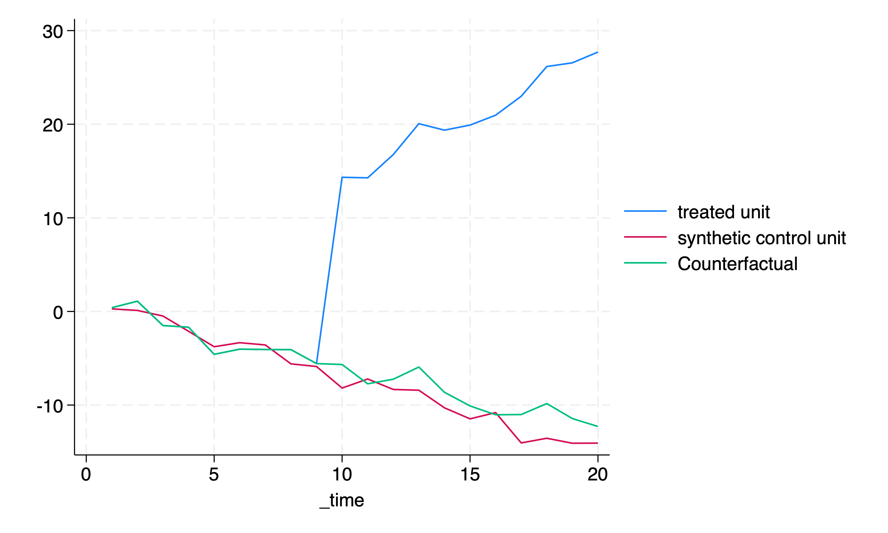

```{r setup, include=FALSE}
knitr::opts_chunk$set(echo = TRUE, message = FALSE)
library(Statamarkdown)
```

# This week
* Previous week ([DID and TWFE](https://jisangyu-agecon.github.io/AGEC936/Lectures/AGEC936_DD_FE_Synth.html))
* Synthetic control methods
* Some time-series considerations

# When do DinD research designs work
* Parallel trend assumption
  + This is the key!
  + Staggered DinD designs also need the parallel trend assumption.
* For statistical power and inference, we need enough obervations in each *group*.

* What if
  + we cannot assume the parallel trend?
  + we only have **one** observation for treated unit?

# Synthetic control methods
* Foundational piece: @abadie2010synthetic (originally developed by @abadie2003economic)
* When?: (Normally but not necessarily), **one** treated unit ($i=1$), **many** control units, and (somewhat) long time period.
* Back to **potential outcome representation**: we want
$$
\tau_{t}=y_{1t}(1)-y_{1t}(0)
$$
* What do we observe? 
  + $y_{1t}=y_{1t}(0)$ if $t<t^*$, 
  + $y_{1t}=y_{1t}(1)$ if $t \geq t^*$,
  + $y_{it}=y_{it}(0)$ for $i\neq1$.
  + But, **we need $y_{1t}(0)$ for $t>t^*$!**
* The **key idea**: Let's combine $y_{it}$ for $i\neq1$ to estimate $y_{1t}(0)$ for $t>t^*$.
* Underlying model for the potential outcome, $y_{it}(0)$, is (equation (1) of @abadie2010synthetic)
  $$
  y_{it}(0)=\delta_{t}+\theta_t Z_i + \lambda_t\mu_i+\varepsilon_{it}.
  $$
* Suppose if there are $w^*$ that satisfy
  $$
  \sum_{j=2} w^{*}_j y_{js}=y_{1s}\;\;\forall\;\;s<t^*,
  $$
  $$
  \sum_{j=2} w^{*}_j Z_{j}=Z_{1}\;\;\forall\;\;s<t^*.
  $$
* Under certain conditions, we have $\sum_{j=2} w^{*}_j y_{jt}$ approximately equal to $y_{1t}(0)$. Thus, we can use
  $$
  \hat{\tau}_t=y_{1t}-\sum_{j=2} w^{*}_j y_{jt}\;\;\forall\;\;t>t^*
  $$
* Estimation (see equation (7) of @abadie2021using):
  $$
  Min_{w_j,j\neq1}\;\left(\sum_h v_h \left(X_{1h}-\sum_{j=2} w_j X_{jh}\right)^2\right)
  $$
  subject to
  $$
  w_j\geq 0\;\;\text{and}\;\;\sum_{j=2}w_j = 1
  $$
  and $X_h$ are "predictors", which include $y_{js}$ for $j\neq 1$ and $s<t^*$, and $Z_j$ for $j\neq1$.
* How do we choose $v_h$?: @abadie2010synthetic uses $v_h$ such that produce $w_j$ such that they minimize the out-of-sample mean squared prediction error for some set times in the pre-intervention period.
* Seems cool... any issues?

  
# A simple simulation
```{stata synthstata, results="hide"}  
clear all
set obs 5
set seed 1234

*id
gen id=_n

*time invariant var
gen x=3*rnormal()

*expand
expand 20

*time var
bys id: gen t=_n

*error
gen e=rnormal()

*treatment to id=1 after t=10
gen d=0
replace d=1 if id==1 & t>=10

*outcome
gen y=2+0.5*x+0.5*t*x+2*t*d+e

*synth
xtset id t
*compare with actual counterfactual
tempfile temp
synth y y(1) y(2) y(3) y(4) y(5) x(1(1)5), trunit(1) trperiod(10) mspeperiod(5(1)8) keep(`temp')

use `temp', clear
gen real_counterfactual=_Y_treated
replace real_counterfactual=_Y_treated-2*_time if _time>=10
label var real_counterfactual "Counterfactual"

*plot
tw (line _Y_treated _time) (line _Y_synthetic _time) (line real_counterfactual _time), graphregion(color(white))
graph export "synth.png", replace
```

```{r, echo=FALSE, fig.align='center', out.width="70%"}
   
```

# An example [@abadie2003economic]
* **Background**
  1. Looks at the relationship between terrorism and regional GDP in Spain.
  2. Specifically, the paper estimates the impact of terrorist conflicts in the Basque Country.
  3. Control units (or potential "donors") are 16 other Spanish regions.
  4. Sample period: 1955 - 1997 (pre-treatment period: 1955 - 1969, valdiation period: 1960 - 1969)
  5. Uses 14 predictors
  
```{r basque, results="hide"}
library(Synth)
data(basque)
#Data preparation
dataprep.out <- dataprep(
foo = basque,
predictors = c("school.illit", "school.prim", "school.med",
"school.high", "school.post.high", "invest"),
predictors.op = "mean",
time.predictors.prior = 1964:1969,
special.predictors = list(
list("gdpcap", 1960:1969 , "mean"),
list("sec.agriculture", seq(1961, 1969, 2), "mean"),
list("sec.energy", seq(1961, 1969, 2), "mean"),
list("sec.industry", seq(1961, 1969, 2), "mean"),
list("sec.construction", seq(1961, 1969, 2), "mean"),
list("sec.services.venta", seq(1961, 1969, 2), "mean"),
list("sec.services.nonventa", seq(1961, 1969, 2), "mean"),
list("popdens", 1969, "mean")),
dependent = "gdpcap",
unit.variable = "regionno",
unit.names.variable = "regionname",
time.variable = "year",
treatment.identifier = 17,
controls.identifier = c(2:16, 18),
time.optimize.ssr = 1960:1969,
time.plot = 1955:1997)
#Further variable consolidation and manipulation following Abadie et al 2011 (Journal of Statistical Software)
dataprep.out$X1["school.high",] <- dataprep.out$X1["school.high",] +
dataprep.out$X1["school.post.high",]
dataprep.out$X1 <- as.matrix(dataprep.out$X1[
-which(rownames(dataprep.out$X1) == "school.post.high"),])
dataprep.out$X0["school.high",] <- dataprep.out$X0["school.high",] +
dataprep.out$X0["school.post.high",]
dataprep.out$X0 <- dataprep.out$X0[
-which(rownames(dataprep.out$X0) == "school.post.high"),]
lowest <- which(rownames(dataprep.out$X0) == "school.illit")
highest <- which(rownames(dataprep.out$X0) == "school.high")
dataprep.out$X1[lowest:highest,] <-
(100 * dataprep.out$X1[lowest:highest,]) /
sum(dataprep.out$X1[lowest:highest,])
dataprep.out$X0[lowest:highest,] <-
100 * scale(dataprep.out$X0[lowest:highest,], center = FALSE,
scale = colSums(dataprep.out$X0[lowest:highest,]))
#Synth estimation
synth.out <- synth(data.prep.obj = dataprep.out, method = "BFGS")
synth.tables <- synth.tab(dataprep.res = dataprep.out,synth.res = synth.out)
hat.w.scm1<-synth.tables$tab.w[,1]
#Observed and Synthetic Basque
obs.Y.1t<-dataprep.out$Y1
hat.Y.1t.scm1<-(dataprep.out$Y0)%*%hat.w.scm1
```
```{r basque_results, collectcode=TRUE}
#Weights
synth.tables$tab.w
#Plot
Year<-1955:1997
plot(Year,obs.Y.1t,ylim=c(3,12),ylab="real per-capita GDP(1986 USD, thousand)",type='l',lwd=2)
abline(v=1970,lty=3,col=1)
lines(Year,hat.Y.1t.scm1,col=4,lwd=2,lty=1)
```

# Different cross-validation splits
* What if we use 1955 - 1969 instead of 1960 - 1969?
```{r basque2, results="hide"}
library(Synth)
data(basque)
#Data preparation
dataprep.out <- dataprep(
foo = basque,
predictors = c("school.illit", "school.prim", "school.med",
"school.high", "school.post.high", "invest"),
predictors.op = "mean",
time.predictors.prior = 1964:1969,
special.predictors = list(
list("gdpcap", 1960:1969 , "mean"),
list("sec.agriculture", seq(1961, 1969, 2), "mean"),
list("sec.energy", seq(1961, 1969, 2), "mean"),
list("sec.industry", seq(1961, 1969, 2), "mean"),
list("sec.construction", seq(1961, 1969, 2), "mean"),
list("sec.services.venta", seq(1961, 1969, 2), "mean"),
list("sec.services.nonventa", seq(1961, 1969, 2), "mean"),
list("popdens", 1969, "mean")),
dependent = "gdpcap",
unit.variable = "regionno",
unit.names.variable = "regionname",
time.variable = "year",
treatment.identifier = 17,
controls.identifier = c(2:16, 18),
time.optimize.ssr = 1955:1969,
time.plot = 1955:1997)
#Further variable consolidation and manipulation following Abadie et al 2011 (Journal of Statistical Software)
dataprep.out$X1["school.high",] <- dataprep.out$X1["school.high",] +
dataprep.out$X1["school.post.high",]
dataprep.out$X1 <- as.matrix(dataprep.out$X1[
-which(rownames(dataprep.out$X1) == "school.post.high"),])
dataprep.out$X0["school.high",] <- dataprep.out$X0["school.high",] +
dataprep.out$X0["school.post.high",]
dataprep.out$X0 <- dataprep.out$X0[
-which(rownames(dataprep.out$X0) == "school.post.high"),]
lowest <- which(rownames(dataprep.out$X0) == "school.illit")
highest <- which(rownames(dataprep.out$X0) == "school.high")
dataprep.out$X1[lowest:highest,] <-
(100 * dataprep.out$X1[lowest:highest,]) /
sum(dataprep.out$X1[lowest:highest,])
dataprep.out$X0[lowest:highest,] <-
100 * scale(dataprep.out$X0[lowest:highest,], center = FALSE,
scale = colSums(dataprep.out$X0[lowest:highest,]))
#Synth estimation
synth.out <- synth(data.prep.obj = dataprep.out, method = "BFGS")
synth.tables <- synth.tab(dataprep.res = dataprep.out,synth.res = synth.out)
hat.w.scm1<-synth.tables$tab.w[,1]
#Observed and Synthetic Basque
obs.Y.1t<-dataprep.out$Y1
hat.Y.1t.scm1<-(dataprep.out$Y0)%*%hat.w.scm1
```
```{r basque_results2, collectcode=TRUE}
#Weights
synth.tables$tab.w
#Plot
Year<-1955:1997
plot(Year,obs.Y.1t,ylim=c(3,12),ylab="real per-capita GDP(1986 USD, thousand)",type='l',lwd=2)
abline(v=1970,lty=3,col=1)
lines(Year,hat.Y.1t.scm1,col=4,lwd=2,lty=1)
```

# Placebo test
* Test with other region (Cataluna)
```{r placebo, collectcode=TRUE, results="hide"}
dataprep.out <- dataprep(
foo = basque,
predictors = c("school.illit", "school.prim", "school.med",
"school.high", "school.post.high", "invest"),
predictors.op = "mean",
time.predictors.prior = 1964:1969,
special.predictors = list(
list("gdpcap", 1960:1969 , "mean"),
list("sec.agriculture", seq(1961, 1969, 2), "mean"),
list("sec.energy", seq(1961, 1969, 2), "mean"),
list("sec.industry", seq(1961, 1969, 2), "mean"),
list("sec.construction", seq(1961, 1969, 2), "mean"),
list("sec.services.venta", seq(1961, 1969, 2), "mean"),
list("sec.services.nonventa", seq(1961, 1969, 2), "mean"),
list("popdens", 1969, "mean")),
dependent = "gdpcap",
unit.variable = "regionno",
unit.names.variable = "regionname",
time.variable = "year",
treatment.identifier = 10,
controls.identifier = c(2:9, 11:16, 18),
time.optimize.ssr = 1960:1969,
time.plot = 1955:1997)
#Further variable consolidation and manipulation following Abadie et al 2011 (Journal of Statistical Software)
dataprep.out$X1["school.high",] <- dataprep.out$X1["school.high",] +
dataprep.out$X1["school.post.high",]
dataprep.out$X1 <- as.matrix(dataprep.out$X1[
-which(rownames(dataprep.out$X1) == "school.post.high"),])
dataprep.out$X0["school.high",] <- dataprep.out$X0["school.high",] +
dataprep.out$X0["school.post.high",]
dataprep.out$X0 <- dataprep.out$X0[
-which(rownames(dataprep.out$X0) == "school.post.high"),]
lowest <- which(rownames(dataprep.out$X0) == "school.illit")
highest <- which(rownames(dataprep.out$X0) == "school.high")
dataprep.out$X1[lowest:highest,] <-
(100 * dataprep.out$X1[lowest:highest,]) /
sum(dataprep.out$X1[lowest:highest,])
dataprep.out$X0[lowest:highest,] <-
100 * scale(dataprep.out$X0[lowest:highest,], center = FALSE,
scale = colSums(dataprep.out$X0[lowest:highest,]))
#Synth estimation
synth.out <- synth(data.prep.obj = dataprep.out, method = "BFGS")
synth.tables <- synth.tab(dataprep.res = dataprep.out,synth.res = synth.out)
hat.w.scm1<-synth.tables$tab.w[,1]
#Observed and Synthetic Cataluna
obs.Y.1t<-dataprep.out$Y1
hat.Y.1t.scm1<-(dataprep.out$Y0)%*%hat.w.scm1
```
```{r placebo_results, collectcode=TRUE}
#Weights
synth.tables$tab.w
#Plot
Year<-1955:1997
plot(Year,obs.Y.1t,ylim=c(3,12),ylab="real per-capita GDP(1986 USD, thousand)",type='l',lwd=2)
abline(v=1970,lty=3,col=1)
lines(Year,hat.Y.1t.scm1,col=4,lwd=2,lty=1)
```

# Some recent applications in agricultural/applied economics
* Immigration enforcement on agriculture (labor, crop production, and profitability): @luo2021stringent (replication data/code available at [the AJAE article website](https://onlinelibrary.wiley.com/doi/full/10.1111/ajae.12271))
* Economic/health effects of the environmental or natural disaster: @guilfoos2018economic, @mohan2017economic, and @coffman2012hurricane
* Impacts of trade or economic liberalization: @olper2018trade and @billmeier2013assessing

# Things to consider [@abadie2021using]
* See the latest review of @abadie2021using
* Highlighted features of Synthetic control method
  + No extrapolation: Why matter? See @king2006dangers.
  + Sparsity across "donors": Interpretability
* Things to consider
  + Effect sizes and the volatility in the outcome of the treated unit.
  + Choosing "predictors" and $v_h$
  + Time dimension: the lengths of pre- and post- intervention periods
  + Donor pool
  + **Inference**
  
# Recent development
* Flexibility versus extrapolation risks
  + Possible negative weights: @doudchenko2016balancing
  + Non-negative but weights do not necessarily sum to one: @li2020statistical
  + Non-negative, weights sum to one, but allow parallel shifts (a constant can be added or subtracted): @goh2022synthetic
* Predictors for the weights estimation: @kaul2021standard and @botosaru2019role
* Imperfect pretreatment fit: @ben2021augmented and @ferman2021synthetic
* Innovations in inference techniques
  + Frequentist approaches: e.g.  @chernozhukov2021exact, @li2020statistical, and @firpo2018synthetic
  + Bayesian approaches: e.g. @goh2022synthetic and @amjad2018robust
* Extension to disaggregated data: @ben2021synthetic, @abadie2021penalized, and @arkhangelsky2021


# Some time-series considerations in Panel data setting
* Panel unit root test
  + Tests for stationarity of the panel time series
  + Each test has either different null or different asymptotics (see page 8 of xtunitroot Stata help file)
  + Some references: @levin2002unit, @im2003testing, or Stata's xtunitroot help file.
  
* Panel Vector Autoregression: Be aware of Nickell bias (Dissappears with large T, for short T, see Arellano-Bond-type first-differenced GMM estimators)
  + Some references: @abrigo2016estimation and @holtz1988estimating

# Next week
[Panel IV/GMM and Shift-share deisgn](https://jisangyu-agecon.github.io/AGEC936/Lectures/AGEC936_Panel_IV_GMM.html)

# References


